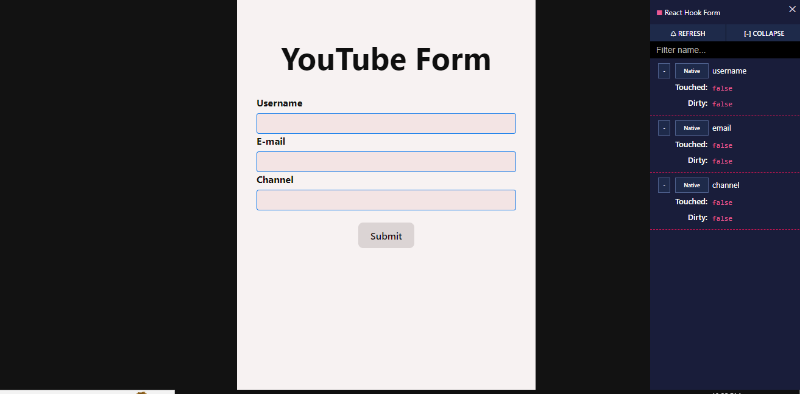

## Description

This project demonstrates creating a form using React and TypeScript, showcasing the following features:

- Form Validation
- Form Submission
- Form State Management using the          - react-hook-form` library

### The form includes the following fields:

- Name
- Email
- Message

### Technologies Used:

- React
- TypeScript
- react-hook-form library

## How to Run

1. Clone the Repository:
   git clone <repository-url>
   

2. Navigate to the Project Directory:
   cd task-5
   

3. Install the Dependencies:
   npm install
   

4. Start the Development Server:
   npm run dev
   

5. Open Your Browser and Navigate to:
   
      http://localhost:5173/   

The Form

Form validation 

Validation for invalid email

Error message removed after entering valid data

Responsive design

